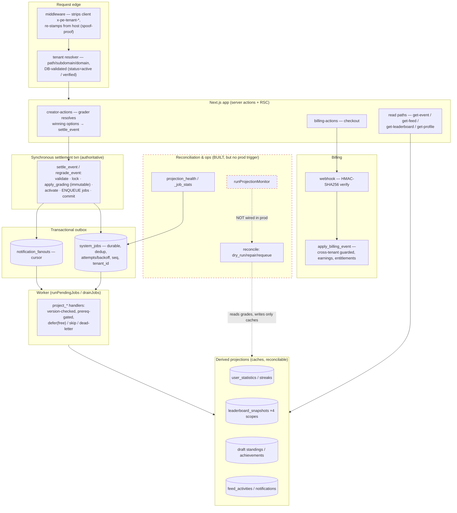
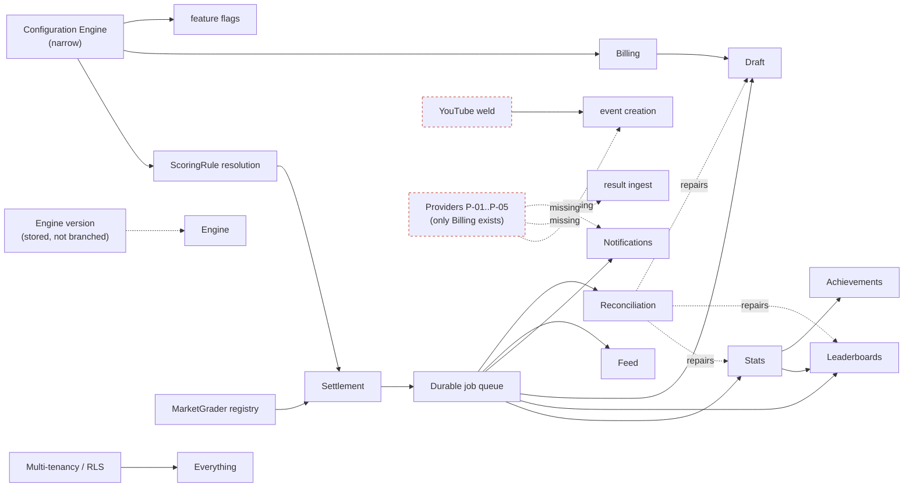

# Prediction Engine — Architecture Review v2

**Read-only principal-architect audit, conducted immediately after Phase 7.5 (Platform Hardening & Genericity Completion).**
Counterpart to Architecture Review v1 and the [Architecture Findings Register](architecture-findings-register.md).
Method: every v1 finding was re-verified against the **actual code, migrations, and tests** (not the register's self-reported status) via six parallel evidence sweeps, with file:line citations. Where the register and the code disagree, the **code wins** and the discrepancy is flagged.

> Scope note: this review is run at the *end of the §5 async-settlement work and before* the provider / de-verticalization / performance sections (§7–§17) that the phase plan slates for later. Those sections are therefore assessed as **not-yet-built**, not as failures.

---

## 1. Executive summary

Phase 7.5 set out to turn a working single-vertical prediction app into a **generic, multi-tenant substrate for multiple independent products**. Measured against that goal, the phase delivered its **hardest and highest-risk half** convincingly and left its **genericity-breadth half** for later.

**What is genuinely fixed (verified in code + tests):**
- The two most dangerous v1 findings — **dual payment stacks (F-01)** and **synchronous full-tenant recompute at settlement (F-02)** — are both **resolved**. Payments run through one HMAC-SHA256 `BillingProvider` pipeline; settlement is now an async transactional-outbox pipeline whose synchronous transaction only validates/locks/grades/commits.
- The async pipeline is **durable, retryable, idempotent, tenant-scoped, and version-aware**, with explicit prerequisites, free deferral, visible dead-lettering, and a proven convergence guarantee (regrade/stale/duplicate/concurrent all reconcile to a canonical rebuild).
- **Reconciliation & repair** (dry-run/repair/requeue + health/stats) is built and tested — a substantial operability substrate that did not exist in v1.
- Multi-tenant isolation is **strong**: 66/66 tables have RLS; tenant resolution is spoof-proof and DB-validated; the money path is DB-enforced and type-safe.
- Grading is a **strategy registry** (raises on unknown, never silent-voids); scoring is **configuration-resolved**; leaderboards cover **all four scopes**; draft positions **survive regrade**; notification fan-out is **async and resumable**.
- **Naming constraint honored**: zero references to any downstream vertical/product anywhere in the tree.

**What is not yet a multi-product foundation (verified gaps):**
- **A production launch blocker**: the async job queue has **no production trigger** — the worker and reconciliation are invoked only from tests. In production, grades would commit but projections would never run.
- **Engine versioning is scaffolding**: the "pin + never-latest" guard is enforced, but **no engine behavior branches on the version yet** (a single supported version).
- **The Configuration Engine is narrow**: only revenue-split, default engine version, and feature flags are truly config-resolvable; vocabulary, media requirements, default locale, and provider selection are not.
- **A hard vertical assumption remains**: **YouTube is still welded** into event creation at the DB (RPC + trigger), API (zod), and UI layers. A non-video product literally cannot create an event.
- **No provider abstractions** beyond billing (P-01…P-05 unbuilt; result/notification enum values dormant); **no admin/ops surface** (F-23).
- A cluster of **moderate/minor genericity & performance findings** (F-06, F-13, F-17, F-18, F-20, F-21, F-22, F-27) remain **Open** and have not been given an explicit terminal disposition.

**Bottom line.** The platform is now a **robust, correct, well-isolated multi-tenant engine for the video-prediction vertical it grew from**, with an excellent settlement/jobs/billing/reconciliation core. It is **not yet** a turnkey foundation for *arbitrary* independent products: that requires the de-verticalization, provider, config-breadth, and real-versioning work still ahead. **Phase 8 approval is conditional** (see §12/§15) — not blocked by any open Critical, but gated on operability wiring, explicit deferral of the remaining moderates, and register/code reconciliation.

**Overall architecture score: v1 7.4/10 → v2 8.1/10.**

---

## 2. v1 → v2 at a glance

| Dimension | v1 | v2 | Movement |
| --- | --- | --- | --- |
| Overall architecture | 7.4 | **8.1** | ▲ settlement/jobs/billing/tenancy hardened |
| Genericity | ~6.0 | **6.5** | ▲ grader registry + config foundation; ▼ YouTube weld, narrow config, no providers |
| Security | ~7.5 | **8.5** | ▲ 66/66 RLS, typed money path, spoof-proof tenancy |
| Scalability | ~6.5 | **8.0** | ▲ async settlement removes O(all-users) txn; ▼ read-time social aggregation |
| Operability | ~5.0 | **6.0** | ▲ reconciliation/health built; ▼ no prod trigger/admin surface |
| Maintainability | ~7.0 | **8.0** | ▲ enum-parity test, typed RPC, docs; ▼ register/doc drift |
| Developer experience | ~7.0 | **7.5** | ▲ typed helpers, deterministic tests |
| Production readiness | ~6.0 | **7.0** | ▲ correctness/isolation; ▼ operability wiring |

*v1 per-dimension figures are reconstructed from the v1 findings (only the v1 overall 7.4/10 is recorded verbatim); treat them as calibrated estimates, not quotations.*

---

## 3. Finding-by-finding disposition

Legend: ✅ Resolved · 🟦 Accepted · ⏭ Deferred (Phase 8) · ⬜ Still Open. "Register" = status claimed in the register; "Verdict" = this audit's evidence-based conclusion.

### Critical

**F-01 — Dual payment stacks** · 🔴 · Register: ✅ · **Verdict: ✅ Resolved.**
- *v1 evidence:* two abstractions — FNV-1a non-cryptographic signer (`lib/payments`) + HMAC billing (`lib/billing`); paid draft straddled both.
- *Current evidence:* `src/lib/payments/` gone; `completeMockPaymentAction` gone; `SUBSCRIPTION_*` env removed. Legacy DB path dropped in `0028_unify_draft_payments.sql:161-163` (`confirm_draft_payment`, `draft_payments`, `payment_reference_id`). Webhooks verify HMAC-SHA256 with constant-time compare (`src/lib/billing/signature.ts:8-18`), rejecting on failure before processing (`webhook.ts:20`). Paid draft creates a reservation only (`0028:86-94`) and confirms via `apply_billing_event` (`0030:64-69`).
- *Residual:* one stale doc (`docs/decisions.md:13` still names `SUBSCRIPTION_PROVIDER`); no test asserts the *absence* of the old path. **Recommendation:** fix the doc; low priority.

**F-02 — Synchronous full-tenant recompute at settlement** · 🔴 · Register: ✅ · **Verdict: ✅ Resolved.**
- *v1 evidence:* every settlement rebuilt the whole tenant leaderboard + re-scanned each predictor's full history inside the event-lock transaction — O(all users).
- *Current evidence:* `settle_event`/`regrade_event` (`0036:120-190,192-263`) do validate → lock → grade (`apply_grading`) → activate → **`enqueue_settlement_projections` in the same transaction** → commit; no inline full-tenant recompute. The three synchronous projection triggers are dropped (`0036:289-291`). Jobs are durable/retryable/idempotent/tenant-scoped/version-aware (see §6).
- *Residual (verified):* the old `app.recompute_after_settlement` (`0011:182`) is **orphaned dead code** — unreferenced by the live `0036` functions but still present, with no guard against accidental re-wiring. **Recommendation:** drop it in a cleanup migration.

### Moderate & minor — resolved

**F-03 — Market grading single-winner-only** · 🟠 · **✅ Resolved.** Strategy registry `getMarketGrader` throws `UnsupportedMarketTypeError` on an unregistered type (`graders/index.ts:15-23`, `types.ts:33-38`), unit-proven (`market-grader.test.ts:22-25`). TS resolves winning options and passes `p_winning_option_ids` to `settle_event` (`creator-actions.ts:191-211`). *Residual:* only `SINGLE_CHOICE_WINNER` of 3 enum types is implemented (the others deliberately raise), and the SQL retains a competitor-mapping fallback when `p_winning_option_ids` is null (`0034:44-47`) — so a *future* non-competitor market that forgot to resolve options would silently use competitor mapping rather than raise (the raise lives in TS, not SQL).

**F-04 — Hard-coded SQL scoring** · 🟠 · **✅ Resolved.** `app.resolve_scoring` (competition → tenant-default → global-default, `0034:12-20`) feeds `apply_grading`; resolved points are stored on the immutable grade (`0034:69-71`). `v_points := 1` survives only in superseded function bodies. *Residual:* a legacy `DEFAULT_SCORING` TS constant (`constants.ts:6-13`) coexists (not authoritative); config override path is untested.

**F-05 — Only global leaderboard scope** · 🟠 · **✅ Resolved.** All four scopes verified: global (`0011:105`), creator (`0038:55`), competition & season (`0038:93`, season = competition `type='SEASON'`, chosen at `0038:99-101`) — not a new table. Incremental, version-aware, reconcilable.

**F-08 — `as never` on money-path RPC** · 🟠 · **✅ Resolved (money path).** Money RPCs use `RpcArgs<K>` (`billing-actions.ts:75,104`, `creator-actions.ts:172,211`; `rpc.ts:12`). *Verified caveat:* the blanket "removed" is inaccurate — **10 `as never` casts remain** on the ops/jobs/projection (service-role) path (`ops/reconciliation.ts:56,62,68,74`; `jobs/worker.ts:51,69`; handlers). None are on the funds path. **Recommendation:** type the ops RPC boundary too; low risk.

**F-09 — Enum drift** · 🟠 · **✅ Resolved (one-directional).** `enum-parity.test.ts:36-44` asserts each exported enum equals `Constants.public.Enums`. *Verified gap:* it only checks enums that are exported from `enums.ts`; a SQL enum with no mirror (e.g. `billing_product_type`) is unguarded. **Recommendation:** assert full coverage of SQL enums.

**F-10 — Duplicated logic** · 🟡 · **✅ Resolved.** Single `COMPETITION_TYPE_LABEL` (`constants.ts:23-28`) imported by both pages; bracket generation single-sourced (`bracket.ts` → `competitions.ts`). Seed's demo-only mirror accepted by design.

**F-11 — Hard-coded 80/20 split fallback** · 🟠 · **✅ Resolved.** `app.resolve_revenue_split` = record rule → `tenant_settings` → `platform_config` default (`0031:42-57`), consumed by `apply_billing_event` (`0030:79-81`). Tested at default tier. *Residual:* per-creator override path untested; a documented TS resilience default remains (used only if the DB row is absent).

**F-12 — Recurring renewals may not earn** · 🟠 · **✅ Resolved.** Earnings recorded on `order_created` **and** `subscription_payment_success`/`_recovered`, idempotent per invoice (`0030:74-88`). Tested (renewal → second earning; replay no-op).

**F-15 — Regrade drops recorded finishing positions** · 🟠 · **✅ Resolved.** `event_competitor_results.recorded` distinguishes recorded order from winner-only baseline; `settle_draft_for_event` carries recorded orders forward across a winner-only regrade and **blocks** (never invents a degraded result) when positions are missing and `winner_only_fallback` is false (`0040:67-103`). Tested.

**F-19 — Synchronous per-follower fan-out** · 🟠 · **✅ Resolved.** `on_event_published` now enqueues a feed job + a cursor-based resumable fan-out (`notification_fanouts`), no sync loop (`0042:92-160`); idempotent, preference-aware, eligibility at batch time. Tested.

**F-24 — `mock/pay` route env gate** · 🟡 · Register: ✅ · **Verdict: ✅ Resolved, with a real caveat.** Route returns 404 unless `BILLING_PROVIDER === "mock"` (`route.ts:20`). *Verified caveat:* the gate is on the configured **provider**, not `NODE_ENV`. A production deploy misconfigured to `BILLING_PROVIDER=mock` would expose the self-signing entitlement route. **Untested.** **Recommendation:** add a hard non-production assertion + a test.

**F-25 — Payout persists unvalidated amount** · 🟡 · **✅ Resolved.** BEFORE-INSERT trigger `app.check_payout_request_funds` rejects `amount > available` or `≤ 0` at the DB (`0029:54-76`). Tested (`INSUFFICIENT_EARNINGS`).

**F-26 — Reject-cleanup ordering** · 🟡 · **✅ Resolved (untested).** Insufficient-earnings branch releases reserved earnings before deleting allocations (`0029:38-46`). No regression test on the reject branch. **Recommendation:** add one.

**F-29 — Untyped `as unknown[]` JSONB casts** · 🟡 · Register matrix: ✅ / **register detail still says "Open" (drift)** · **Verdict: ✅ Resolved.** `as unknown[]` = **0 occurrences** repo-wide. (7 `as unknown as` remain — RPC-return deserialization / status coercion — contained.) **Recommendation:** fix the register detail entry to match the matrix.

### Accepted

**F-07 — Closed enums** · 🟠 · **🟦 Accepted (verified reasonable).** Additive `ALTER TYPE ADD VALUE` precedent (`0019`, `0041`); the grader registry localizes a new market type to one registry entry. Deliberate integrity trade-off.

**F-14 — Draft scoring position-only** · 🟠 · **Split (verified):** scoring *values* are config-driven (`draft_scoring_rules.config.position_points`) ✅; additional strategies are an accepted extension point; the regrade/baseline concern is F-15 ✅.

**F-16 — Public `using(true)` tables** · 🟡 · Register: Open→Accept · **Verdict: 🟦 Accept, but a genuine (low-severity) DB-level gap.** 14 `using(true)` SELECT policies (leaderboards, stats, achievements, follows, likes, public pricing, published events/markets) carry **no tenant predicate**; isolation is app-layer `.eq("tenant_id", …)` only. A crafted PostgREST query *can* read another tenant's rows in these tables — but the exposed set is **exclusively public/aggregate data** (no private/money data). **Weakest point:** `get-draft.ts:79` filters by `competition_id` only, *no* `tenant_id`. **Untested** (rls-isolation.test.ts doesn't probe this surface). **Recommendation:** add tenant-predicated RLS as defense-in-depth before high tenant counts; add a cross-tenant read test; fix `get-draft` to include `tenant_id`.

**F-28 — Shared global singletons** · 🟡 · Register: Open→Accept · **Verdict: 🟦 Accept; original framing partly refuted.** The "in-memory singleton" concern does **not** apply — `system_jobs` and `billing_webhook_events` are durable Postgres tables, not process singletons (the only module-level state is a handler-registry `Map` repopulated at cold start). The *valid* residual is that these are **unpartitioned global tables** (no `tenant_id` on the queue) — a legitimate >1,000-tenant partitioning item, not a correctness issue.

### Deferred

**F-23 — No admin / ops surface** · 🟠 · **⏭ Deferred (Phase 8), verified.** No admin directory, no jobs/reconciliation route, no `vercel.json`, no cron. The ops service layer (`worker.ts`, `ops/reconciliation.ts` with rich health/stats types) is invoked **only from integration tests**. See the operability blocker in §7/§12.

### Still open (verified not built; awaiting explicit disposition)

| ID | Sev | Finding | Verified current state | Suggested disposition |
| --- | --- | --- | --- | --- |
| **F-06** | 🟠 | Result source manual-only | `external_provider`/`webhook`/`future_adapter` enum values have **zero consumers**; no `ResultProvider` code | ⏭ Defer (needs P-02 + a real provider) |
| **F-13** | 🟠 | YouTube welded into event creation | Enforced at DB RPC (`0023:43-44`), DB trigger (`0023:80-92`), zod (`creator-actions.ts:145-149`), UI required field | ⏭ Defer (needs MediaProvider/P-03) — **top genericity blocker** |
| **F-17** | 🟠 | Read-time aggregation & event-page N+1 | Per-market loop of option/sentiment/prediction queries (`get-event.ts:73-116`); read-time `COUNT` sentiment (`0007:129-150`); read-time like counts | ⏭ Defer (perf) |
| **F-18** | 🟡 | Feed no keyset pagination | `.order(created_at).limit()` only, no cursor (`get-feed.ts:24-28`) — older activity unreachable | ⏭ Defer (small) |
| **F-20** | 🟡 | Missing `(market_id, status)` index | *Finding mis-worded* — `market_sentiment` is a **function**, not a table; the actionable item is a `predictions(market_id, status)` composite index, which **is absent** | ⏭ Defer (trivial) |
| **F-21** | 🟡 | English-only default question | Hardcoded `'Which competitor will win?'` in 3 creation paths; `default_locale` stored but **never consulted** | ⏭ Defer (needs config vocabulary) |
| **F-22** | 🟠 | No notification channel abstraction | In-app rows only; no `NotificationProvider`/email/push | ⏭ Defer (needs P-04) |
| **F-27** | 🟠 | SQL grading math not covered by tested TS | Broad **integration** coverage of the real SQL exists, **but** all integration suites `describe.skip` when DB env is absent (`helpers.ts:12`) — green with zero math exercised in a credential-less CI | ⏭ Partially mitigated; add a CI DB or a fail-hard guard |

### Companion capabilities

| ID | Capability | Verified state |
| --- | --- | --- |
| P-01 | EventProvider interface | ⬜ Not started (zero hits) |
| P-02 | ResultProvider interface | ⬜ Not started |
| P-03 | MediaProvider interface | ⬜ Not started (F-13 depends on it) |
| P-04 | NotificationProvider interface | ⬜ Not started (F-22 depends on it) |
| P-05 | Plugin manifest | ⬜ Not started (zero `manifest` hits) |
| P-06 | Versioned Engine API | ◻ **Foundation only** — pin + never-latest enforced; **no behavior branches on version** |
| P-07 | Configuration Engine | ◻ **Foundation only** — tiered resolution real but **narrow** (revenue split, version, flags) |

Only **`BillingProvider`** (`billing/provider.ts:17`) is a realized provider abstraction — the proof-of-pattern for the other four.

---

## 4. Architecture diagram (current)

*Red-dashed = built and tested but with no production invocation path.*

---

## 5. Dependency graph (subsystem coupling)

Healthy direction of dependencies (config/tenancy/grader/scoring flow *into* settlement; settlement fans out through the queue; reconciliation is a side-channel that only repairs caches). The dashed red edges are the coupling debts: the YouTube weld into event creation, and the four missing provider seams.

---

## 6. Settlement & projection review (verified)

**Synchronous transaction (authoritative):** `settle_event`/`regrade_event` perform authorize → validate → idempotency-check → `FOR UPDATE` lock → insert result + settlement(pending) → `apply_grading` (immutable grades with resolved points) → activate → enqueue projections **in the same transaction** → advance bracket → audit → commit (`0036:120-263`). No inline full-tenant recompute. ✔

**Async projections & their guarantees (all verified):**
- **Durable/retryable/idempotent/tenant-scoped:** `system_jobs` with `attempts`/`max_attempts`, `2^attempts` backoff capped 3600s, `dedup_key` partial-unique + `on conflict do nothing`, `tenant_id`, `claim_jobs(p_limit, p_tenant)` `FOR UPDATE SKIP LOCKED` (`0035`, `0038:26-43`). ✔
- **Version-aware / stale-safe:** each `project_*` re-checks the active settlement/version and no-ops (`false`/`'stale'`) if superseded; the worker maps that to `skip_job` (terminal, visible). Recompute-from-active-set means even a stale job that ran couldn't corrupt data (`0037:110`, `0042:230`, `0040:110-112`). ✔
- **Prerequisites (explicit, not FIFO):** `app.user_stats_prereqs` → `ready`/`pending`/`blocked`; dependents **defer for free** (`defer_job` decrements the attempt, `0039:39-44`) while pending, **block** if a prereq dead-lettered (`0039`, `0040:186-188`). ✔
- **Dead-letter visible:** `fail_job` sets `status='dead'` (UPDATE, never DELETE) when the budget is spent (`0035:66-79`). ✔
- **Convergence:** streaks are regrade-invariant (`coalesce(starts_at, activated_at) asc nulls last, id asc`, recomputed not ±1, `0037:47`); `regrade-convergence.test.ts` (9) proves the whole pipeline reconciles to a canonical rebuild under multi-regrade / stale / out-of-order / duplicate / concurrent / dead-letter. ✔
- **Reconciliation repair:** `reconcile` dry-run (savepoint rollback, zero side effects — `0043:171-186`) / repair / requeue, reusing the shared internal `recompute_*`/`refresh_*`/`evaluate_achievements` functions (the same ones the async path and the public `rebuild_*` wrappers call), so all three paths converge by construction. ✔

**Verified residuals in this subsystem:**
1. **No production drain trigger** — the worker is never invoked outside tests (see §7). *This is the single most important operational gap.*
2. **Orphaned `recompute_after_settlement`** dead code, un-guarded against re-wiring.
3. **Leaderboard prereq is settlement-wide** — one user's dead stats job `blocks` an entire scoped leaderboard refresh until reconciliation repairs it (correct, but a single poisoned job stalls a scope; monitor `blocked` rate).
4. **Doc/label drift:** my §5H docs named public `rebuild_*` functions and classify labels (`superseded`, `malformed_payload`) that don't match what the code emits (`app.rebuild_scope` calls the internal functions; `classify_projection_job` emits `current_and_actionable`/`dead_letter_current`/`stuck`/`missing_prerequisite`/`stale_version`/`dead_letter_historical`/`resolved`). Substance is correct; names must be reconciled.

---

## 7. Performance & scalability

**Resolved / reduced bottlenecks (verified):**
- The v1 O(all-users) settlement transaction is **gone** — settlement is now bounded work + an enqueue (F-02). ✔
- Notification fan-out is **batched, cursor-based, resumable** (F-19), no linear in-transaction loop. ✔
- Queue is well-indexed: `idx_system_jobs_due (run_at) where pending`, `uq_system_jobs_dedup`, and the §5F claim index `(tenant_id, run_at, seq) where pending`; targeted social indexes landed (`idx_feed_tenant_time`, `idx_notifications_unread`). ✔

**Remaining bottlenecks (verified Open):**
- **Event page N+1 + read-time aggregation** (F-17): per-market option/sentiment/prediction round-trips; sentiment and like counts re-aggregated per request with no maintained counters. Degrades on hot events.
- **No `predictions(market_id, status)` index** (F-20 corrected): the `status <> 'void'` filter is not index-covered.
- **Feed not paginable** (F-18): hard cap at the first N rows.
- **Unpartitioned global tables** (F-28): `system_jobs`, `billing_webhook_events` carry no `tenant_id` partition; fine now, a partitioning item well beyond 1,000 tenants.
- **Single logical job queue**: throughput is one worker loop; horizontal workers are possible (tenant-scoped `claim_jobs`) but there is **no scheduler at all yet**.

**Readiness by scale:**
- **10 tenants:** comfortable, *once a drain trigger exists*.
- **100 tenants:** workable; watch the single-queue throughput and the `blocked` prereq rate; add the missing indexes.
- **1,000 tenants:** requires horizontal workers, table partitioning (F-28), and the maintained social counters (F-17) — not ready.

---

## 8. Genericity scorecard (1–10, with justification)

| Subsystem | Score | Justification |
| --- | --- | --- |
| Multi-tenancy | **9** | 66/66 RLS; spoof-proof, DB-validated resolution. −1: F-16 public-table app-filter gap (untested; `get-draft` lacks a tenant filter). |
| Authentication | **8** | Supabase auth + role/permission matrix; privilege-escalation blocked & tested. Not independently deep-audited here. |
| Billing | **9** | One HMAC pipeline, DB-enforced payout ceiling, idempotent renewals, cross-tenant guard. −1: F-24 provider-gate (not prod-gate) + untested reject branch. |
| Prediction core | **8** | Owner-scoped, reversible grading, immutable revisions. |
| Competition engine | **8** | Four generic formats; bracket advance on settle; single-sourced generation. |
| Market grading | **8** | Strategy registry, raises on unknown. −2: 1 of 3 enum types implemented; SQL competitor fallback can bypass the TS raise. |
| Scoring | **9** | Config-resolved, stored on immutable grade. −1: legacy constant coexists; override untested. |
| Settlement | **9** | Async outbox, authoritative sync txn, version-aware, convergence-proven. −1: orphaned recompute dead code. |
| Jobs | **9** | Durable/retry/backoff/dead-letter/idempotent/tenant-scoped/defer. −1: no prod trigger. |
| Leaderboards | **8** | Four scopes, incremental, reconcilable. −2: some read-time paths; one poisoned stats job blocks a scope. |
| Competitor Draft | **8** | Positions survive regrade; gated fallback; unified paid pipeline. −2: `get-draft` missing tenant filter; single scoring strategy. |
| Social | **6** | Correct, but read-time N+1 aggregation, no feed pagination, missing sentiment index. |
| Creators | **8** | Verification, earnings, follows; self-verify/self-grant blocked & tested. |
| Notifications | **7** | Async batched resumable fan-out (strong). −3: in-app only, no channel/provider abstraction. |
| Configuration | **6** | Tiered resolution real but narrow — only split/version/flags. Vocabulary/media/locale/provider not resolvable. |
| Engine versioning | **5** | Pin + never-latest enforced; central registry. But **no behavior branches on version**; single supported version — scaffolding. |
| Reconciliation | **8** | Dry-run/repair/requeue correct, idempotent, tested. −2: no prod surface; partial cross-tenant guard (4 of 7 scopes unchecked); doc/label drift. |
| Admin & operations | **3** | Typed health/stats/monitor exist but **no route/cron/UI** — inert in production (F-23). |

**Remaining vertical-specific assumptions (verified):** (1) **YouTube** hard-required in event creation (F-13) — the single biggest one; (2) **English default question** + ignored `default_locale` (F-21); (3) **result ingestion is manual-only** with dormant provider enum values (F-06); (4) draft/"competitor" vocabulary is a hardcoded label map (not yet tenant-configurable). Naming is otherwise clean — no downstream product is referenced anywhere.

---

## 9. Versioned-engine review

- **Every tenant pinned to an explicit version:** ✔ `tenants.engine_version NOT NULL default '1.0'` with `check (~ '^[0-9]+\.[0-9]+$')` (`0032:21-22`).
- **"latest" rejected:** ✔ structurally, by the regex constraint; proven (`engine-version.test.ts:27-30`).
- **Supported versions centrally defined:** ✔ `SUPPORTED_ENGINE_VERSIONS = ["1.0"]` (`version.ts:13-17`).
- **Behavior changes introducible without silently changing existing tenants:** ✖ **not yet.** The version is **stored and resolved but never branched on** — no `if (engineVersion …)` / switch anywhere in grading, scoring, settlement, statistics, leaderboards, or draft; the SQL functions take no version parameter. Today, changing any engine behavior *would* alter existing tenants' results, because nothing gates on the pin.
- **Coverage of grading/scoring/settlement/statistics/leaderboards/draft/future:** none are version-branched yet.

**Verdict:** the *guarantee scaffolding* (write-time pin, never-latest) is real and enforced; the *runtime guarantee* (behavior divergence by version) does not exist yet. Until at least one behavior is branched on the version and a second supported version exists end-to-end, "versioned engine" is a promise, not a capability. **This is the most over-stated item in the register** and should be re-labeled "foundation only."

---

## 10. Configuration review

- **Platform defaults:** ✔ `platform_config` singleton (`0031:19-30`).
- **Tenant overrides + typed resolution:** ✔ for revenue split (record → tenant → platform, `0031:42-57`); typed accessor `getPlatformConfig` (`platform.ts:21-41`).
- **Feature flags:** ✔ tenant-scoped, 15 flags with documented defaults (`feature-flags.ts`), tested.
- **Engine version default:** ✔ `platform_config.default_engine_version`.
- **Vocabulary / market defaults / media requirements / provider selection / billing settings / default locale:** ✖ **not config-resolvable** — vocabulary is a hardcoded label map; the default question is a hardcoded English literal; media requirement is the hard YouTube weld; provider selection is an env switch, not tenant config; locale is stored but ignored.

**Can a new tenant be created without touching core code?** *Mostly.* Only `slug` + `display_name` are required; engine version, revenue split, and flags fall back to defaults. But the new tenant **inherits the video-prediction vertical wholesale** — it cannot change vocabulary, default question/locale, or drop the YouTube requirement without code/migration changes. So: config-*instantiable*, not yet config-*shapeable*.

---

## 11. Test-quality review

**Totals (verified):** 257 tests across 11 unit + 18 integration files; two consecutive clean full runs; lint + build clean. 43 migrations.

**Coverage that proves architecture (not just counts):**
- **Concurrency:** `regrade-convergence` (concurrent settle → exactly one active; concurrent regrades), `reconciliation` (concurrent identical run → one row), `job-lifecycle` (claim/`SKIP LOCKED`). ✔
- **Regrade:** `regrade-convergence` (v1→v2→v3, back-to-A), `user-stats`, `draft-achievements`. ✔
- **Stale-job:** `async-settlement` (old-version job stays visible, non-authoritative), `regrade-convergence` (stale no-op). ✔
- **Dead-letter:** `job-lifecycle` (retry→dead, visible), `regrade-convergence` (current-prereq dead → blocked; old dead never blocks current). ✔
- **Reconciliation:** `reconciliation` (dry-run zero-diff, corrupt→repair idempotent, requeue preserves original, fan-out resume, health states). ✔
- **Cross-tenant security:** `rls-isolation` (membership, private profile, privilege escalation, settings, self-verify, idempotency ledger). ✔ for **private** data.
- **Billing:** `billing` (split, renewal earnings, payout ceiling). ✔

**Verified gaps in what the tests prove:**
1. **Integration suites skip silently without DB env** (`integrationEnvReady`, `helpers.ts:12`) — a credential-less CI reports green having exercised **zero** settlement/billing/RLS behavior. This is the most material test-infrastructure risk (F-27). **Fix:** provision a CI database or fail hard when the env is absent.
2. **F-16 public-table surface untested** — no test attempts a cross-tenant read of a `using(true)` table, so dropping an app-layer `tenant_id` filter would pass CI.
3. **Untested resolved behaviors:** F-24 route gate, F-26 reject-ordering, F-11 override path.
4. No test asserts the *absence* of the removed legacy payment path.

---

## 12. Production-readiness decision

**Hard cross-cutting blocker for any async-settlement launch:** there is **no production trigger to drain the job queue** (no route/cron/`vercel.json`; worker runs only under test). Until a minimal authenticated drain endpoint or scheduled job exists, settlement commits grades but **projections never run in production**. Every "ready" below is contingent on fixing this.

| Target | Decision | Conditions |
| --- | --- | --- |
| Small production launch (single video-prediction tenant) | **Ready with conditions** | Drain trigger; F-24 prod-gate; the tenant *is* a video vertical (YouTube weld is fine). |
| Multiple tenants (same vertical) | **Ready with conditions** | Above + F-16 defense-in-depth + `get-draft` tenant filter. |
| Creator monetization | **Ready with conditions** | F-24 hard prod assertion; add F-26/F-11-override tests. |
| Paid Competitor Draft | **Ready with conditions** | Kept behind its flag; unified pipeline solid; `get-draft` tenant filter. |
| Automated result providers | **Not ready** | F-06 dormant; needs ResultProvider (P-02). |
| High-volume events | **Not ready** | F-17 read-time aggregation, F-20 index, F-18 pagination. |
| 100 tenants | **Ready with conditions** | Drain trigger + horizontal workers advisable; monitor blocked-prereq rate. |
| 1,000 tenants | **Not ready** | Partitioning (F-28), horizontal workers, maintained social counters. |

---

## 13. Remaining technical debt

| Item | Class | Evidence | Risk | Trigger | Effort | Blocks Phase 8? |
| --- | --- | --- | --- | --- | --- | --- |
| No production job-drain trigger | **Critical (operational)** | worker invoked only in tests | Async settlement inert in prod | Any deploy | S (one authenticated cron/route) | **Yes** (operability gate) |
| Register/doc ↔ code drift (F-29 detail; §5H `rebuild_*`/classify labels; stale `SUBSCRIPTION_PROVIDER` doc) | **Moderate** | §3, §6 | "Register matches code" gate unmet | Before Phase 8 sign-off | S | **Yes** (register-match gate) |
| Open moderates lack explicit disposition (F-06, F-13, F-17, F-22, F-27) | **Moderate** | §3 | Gate requires resolve/accept/defer | Before Phase 8 | S (register update) or L (build) | **Yes** (as a disposition) |
| Engine versioning not branched | Moderate | §9 | Behavior change silently affects all tenants | First divergent behavior | M | No (but relabel foundation) |
| Config engine narrow | Moderate | §10 | New tenant can't reshape vertical | Second vertical | M–L | No |
| YouTube weld (F-13) | Moderate | §8 | Non-video product can't create events | Second vertical | M | No (Phase 8 work) |
| Read-time social aggregation (F-17/F-18/F-20) | Moderate | §7 | Degrades on hot events | High volume | M | No |
| Orphaned `recompute_after_settlement` | Minor | §6 | Accidental re-wiring | Cleanup | S | No |
| F-16 public-table DB gap + `get-draft` no tenant filter | Minor (security, low) | §3/§8 | Cross-tenant read of aggregate data | Pre-scale hardening | S | No |
| Partial reconcile cross-tenant guard (4/7 scopes) | Minor (security) | §3 | Super-admin cross-tenant scope on user/settlement/season/tenant | Pre-Phase-8 | S | No |
| 10 `as never` on ops path; F-24 provider-gate; untested F-26/F-11 | Minor | §3 | Type/gate/regression risk | Opportunistic | S | No |
| Unpartitioned global tables (F-28) | Accepted | §7 | >1,000-tenant hotspot | Scale trigger | L | No |

---

## 14. Score comparison

| Category | v1 | v2 | What changed |
| --- | --- | --- | --- |
| Overall architecture | 7.4 | **8.1** | Async settlement, unified billing, full RLS, reconciliation substrate. |
| Genericity | 6.0 | **6.5** | Grader registry + config/version *foundations*; still gated by YouTube weld, narrow config, no providers, version-not-branched. |
| Security | 7.5 | **8.5** | 66/66 RLS, spoof-proof DB-validated tenancy, typed money path, cross-tenant guards. Held back by the F-16 public gap. |
| Scalability | 6.5 | **8.0** | O(all-users) settlement removed; batched fan-out; queue indexes. Held back by read-time social + single queue. |
| Operability | 5.0 | **6.0** | Reconciliation/health/classify/monitor built & tested — but no prod trigger/UI caps the gain. |
| Maintainability | 7.0 | **8.0** | Enum-parity test, typed RPC, dedup, thorough docs. Docked for register/doc drift. |
| Developer experience | 7.0 | **7.5** | Typed RPC helpers, deterministic tenant-scoped tests. |
| Production readiness | 6.0 | **7.0** | Correctness/isolation strong; operability wiring + genericity breadth pending. |

---

## 15. Final deliverable — verdict & Phase 8 recommendation

**Strengths (verified):** unified cryptographic billing; async, authoritative, version-aware settlement with proven convergence; durable idempotent tenant-scoped job queue; reconciliation & repair; complete RLS with spoof-proof, DB-validated tenancy; strategy-based grading and configuration-resolved scoring; four leaderboard scopes; regrade-safe draft positions; resumable notification fan-out; clean, vertical-neutral naming.

**Weaknesses (verified):** no production job-drain trigger; engine versioning not yet branched; narrow configuration; hard YouTube weld; no provider abstractions beyond billing; no admin/ops surface; read-time social aggregation; a handful of untested resolved behaviors; register/code drift.

**Risk matrix:**

| Likelihood ↓ / Impact → | Low | Medium | High |
| --- | --- | --- | --- |
| **High** | untested F-24/F-26 | read-time social on hot events (F-17) | **no prod job drain** (settlement inert) |
| **Medium** | F-16 aggregate read | config too narrow for 2nd vertical | versioning-not-branched surprises tenants |
| **Low** | orphaned dead code | partial reconcile cross-tenant guard | unpartitioned tables at 1,000 tenants |

**Scaling assessment:** ready-with-conditions to ~100 tenants of the current vertical once the queue is driven and indexes land; not ready for 1,000 tenants (partitioning, horizontal workers) or for high-volume events (maintained counters) or automated result ingestion (providers).

**Phase 8 gate — applying the FINAL RULE:**

| Gate condition | Met? |
| --- | --- |
| No Critical findings open | ✅ (F-01, F-02 resolved) |
| All Moderate findings resolved / accepted / **explicitly deferred** | ⚠️ **Not yet** — F-06, F-13, F-17, F-22, F-27 are still "Open," not explicitly deferred |
| Architecture Findings Register matches the code | ⚠️ **Not yet** — drift in F-29 detail, §5H labels, one env doc |
| Platform can be operated and repaired | ⚠️ **Repaired yes, operated no** — no prod trigger for the queue/monitor |
| Ready for tenant-configuration testing | ⚠️ **Partial** — config surface is narrow |

**Recommendation: DO NOT auto-approve Phase 8. Approve once these low-effort conditions are met (days, not weeks):**
1. **Wire a production job-drain trigger** (one authenticated cron/route calling `drainJobs`, plus the same for `runProjectionMonitor`). This is the operability gate and the launch blocker.
2. **Explicitly defer** the still-open moderates (F-06, F-13, F-17, F-18, F-20, F-21, F-22, F-27) to Phase 8 in the register, with justification — or resolve the trivial ones (F-20 index, F-18 cursor).
3. **Reconcile register/docs with code** (F-29 detail status; §5H `rebuild_*`/classify label names; the stale `SUBSCRIPTION_PROVIDER` reference), and **relabel P-06 "versioning" as foundation-only** (not "versioned behavior").
4. **Add a CI database or fail-hard guard** so integration suites cannot skip silently (F-27).

After those, Phase 8 — whose natural charter is exactly the deferred cluster (MediaProvider/ResultProvider/NotificationProvider + de-verticalization, admin/ops UI, performance, real version branching) — is cleared to begin.

**Final score: 8.1 / 10** (v1 7.4). Phase 7.5 delivered a genuinely excellent settlement/jobs/billing/tenancy/reconciliation core and a clean, honest substrate; the remaining distance to a true *multi-product* foundation is breadth work (providers, config, de-verticalization, versioning-in-anger) plus the operability wiring — none of it blocked by an unresolved Critical.

---

*Prepared as a read-only audit. No code, migrations, or the findings register were modified in producing this review; §13/§15 list the register reconciliations recommended as Phase-8 preconditions.*
